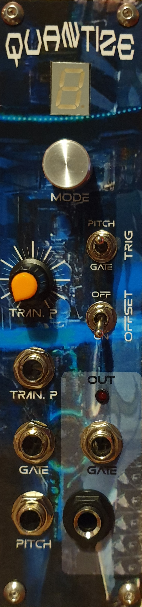
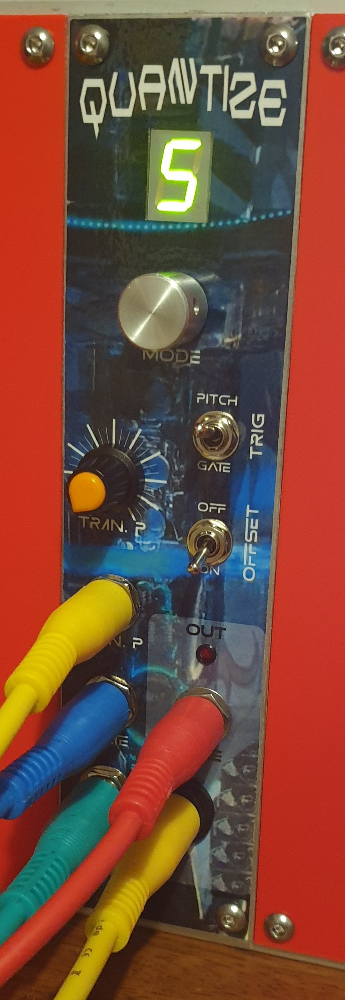
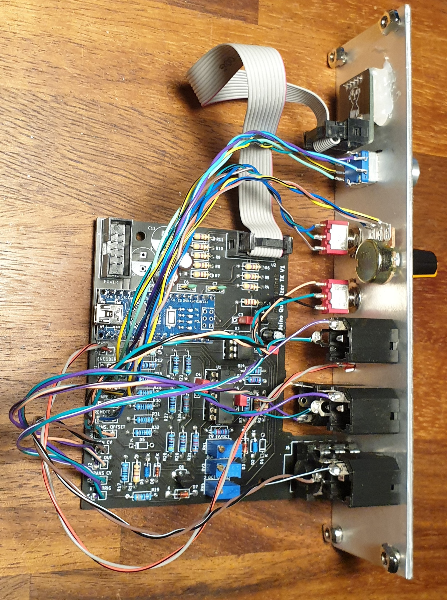
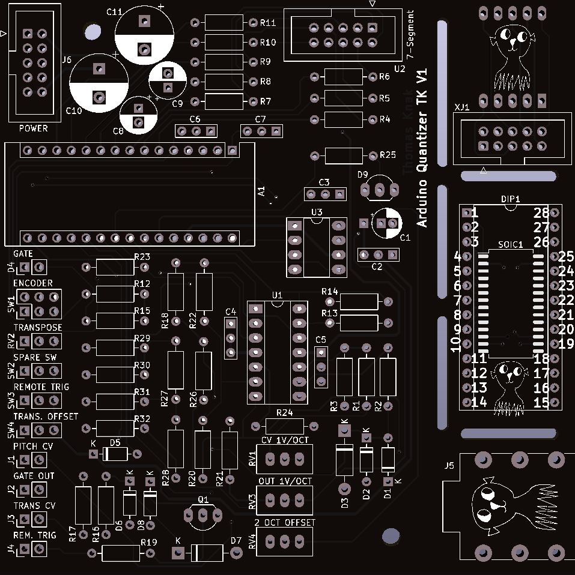
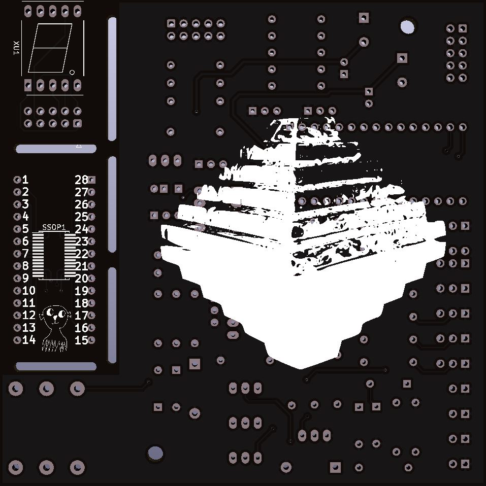

# Modular-Synthesizer-Quantizer
Modular Synthesizer Quantizer with Arduino nano and MCP4921 DAC

Inspired by [Hagiwo](https://note.com/solder_state/n/nde97a0516f03) and [luislutz's](https://github.com/luislutz/Arduino_Quantizer) design

<table>
  <tr>    
    <td></td>
    <td></td>
    <td></td>
  </tr>
 </table>

## Inputs
Pitch CV [0-7V] - Voltage to be quantized.

Trigger [2-12V] - Generate new quantized CV.

Transpose [0-5V] - Transpose quantized CV.

## Outputs
QV [0-9V] - Quantized CV.

Gate [0-10V] - Generates a pulse when QV i changed.

## Knops and switches
Transpose knop - Transpose QV 7 octaves.

Trigger switch - In OFF state QV is only changes when reciving a input trigger signal. In ON state QV is changes when pitch CV or transpose changes to a new note.

Offset switch - Transpose QV 2 octaves.

Mode selector - Encoder to change scales, transpose mode and root note.

<table>
  <tr>
   <td><b>Scale</b></td>
   <td><b>Root note</b></td>
   <td><b>Transpose mode</b></td>   
 </tr>
  <td>Turn mode knop</td>
  <td>Click and hold mode knop while turning</td>
  <td>Double click and turn mode knop</td>
 <tr>    
   <td>
    
| Number | Scale |
|--------|-------|
|0 |Major|
|1 |Major pentatonic|
|2 |Major pentatonic + 7|
|3 |Natural Minor|
|4 |Minor pentatonic|
|5 |Harmonic minor|
|6 |Melodic minor|
|7 |Blues|
|8 |Chromatic|
|9 |Octave|
   </td>

   <td>
    
| Display | Note |
|---------|------|
| C | C |
| C. | C# |
| d | D |
| d. | D# |
| E | E |
| F | F |
| F. | F# |
| G | G |
| G. | G# |
| A | A |
| A. | A# |
| b | B |
   </td>

   <td>
     
| Display | Mode |
|-|-|
| Top | 12 Semitones
| Midt | 7 Semitones|
| Bottom | 1 Semitone|   
   </td>
  
  </tr>
 </table>

# PCB

<table>
  <tr>
    <td>Front</td>
    <td>Back</td>
  </tr>
  <tr>    
    <td></td>
    <td></td>
  </tr>
 </table>
